<p align="center">
  
</p>

<h1 align="center">🩺 Se7tek Pregnancy Monitoring Platform</h1>

<p align="center">
Enterprise Healthcare Analytics Platform + AI Knowledge System for Pregnancy Care
</p>


---

# 📌 Overview

Se7tek Pregnancy Monitoring Platform is an end-to-end healthcare analytics and AI solution designed to monitor:

- Maternal health  
- Pregnancy risks  
- Clinical adherence  
- Medication compliance  
- Medical analysis trends  

The platform combines:

- Enterprise Data Engineering  
- Modern Data Warehousing  
- Business Intelligence  
- AI-powered Medical Knowledge Retrieval (RAG)  
- Web-based Clinical Monitoring  

The system was implemented in two architecture versions:

- On-Premises Architecture  
- Cloud-Native Architecture  

Both architectures serve the same business goal: transforming raw healthcare data into actionable insights for:

- Clinicians  
- Administrators  
- Patients  
---

# 🎯 Project Scope

The platform helps healthcare organizations improve maternal care through advanced analytics and AI.

## Core Objectives

- Early detection of high-risk pregnancies  
- Monitor medication adherence  
- Track lab results & clinical analysis  
- Measure patient engagement  
- Improve doctor performance visibility  
- Provide intelligent medical knowledge support using AI  

---

# 🚀 Key Features

## Data Platform
- Raw healthcare data ingestion
- ETL / ELT pipelines
- Data transformation
- Fact & Dimension modeling
- Star schema design
- Pipeline orchestration

## Business Intelligence
- Interactive dashboards
- KPI monitoring
- Risk analytics
- Medication adherence tracking
- Doctor performance analysis

## AI Knowledge System (RAG)
- Context-aware medical Q&A
- Evidence-based recommendations
- Pregnancy-specific knowledge retrieval
- LLM-powered responses

## Web Application
Unified interface for:

- Clinical monitoring
- Dashboard visualization
- AI assistant
- Patient risk exploration

---

# 🏗️ Architecture Overview

The platform supports two deployment models.

---

# 1️⃣ On-Premises Architecture

## Technology Stack

| Layer | Technology |
|-------|------------|
| Source | SQL Server |
| Ingestion | SSIS |
| Transformation | SQL Stored Procedures |
| Warehouse | SQL Server DW |
| BI | Tableau, Power BI |


---

## Pipeline Flow

```bash
SQL Server → SSIS → STG → ODS → DW → BI Dashboards
```

### Source
Operational databases generating raw healthcare data:
- Patient profiles
- Pregnancy history
- Medications
- Clinical analyses

### Ingestion
Using **SSIS** to load raw data.

### Transformation
- Raw Staging (STG)
- Operational Data Store (ODS)
- Pre-DW Views

### Warehouse
SQL Server DW with:
- Fact tables
- Dimension tables
- Star schema

### Serving / BI
Dashboards in:
- Tableau
- Power BI

---

# 2️⃣ Cloud Architecture

## Technology Stack

| Layer | Technology |
|-------|------------|
| Source | Azure SQL Database |
| Ingestion | Azure Data Factory |
| Transformation | dbt |
| Warehouse | Microsoft Fabric |
| Orchestration | Apache Airflow |
| BI | Tableau, Power BI |

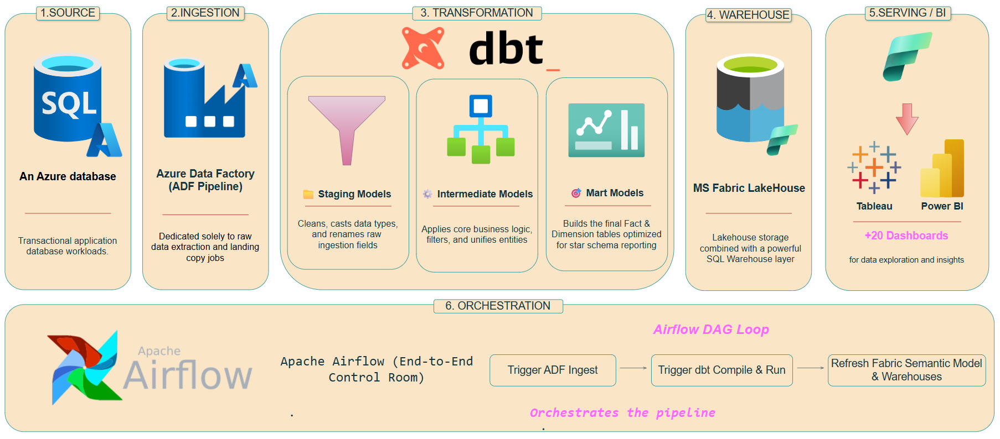

---

## Pipeline Flow

```bash
Azure SQL → ADF → dbt → Fabric → BI
```

### Source
Azure transactional database.

### Ingestion
Using **ADF Pipelines**

### Transformation
Using **dbt**

#### Staging Models
- Clean raw data
- Standardize fields

#### Intermediate Models
- Apply business logic
- Entity unification

#### Mart Models
- Fact tables
- Dimension tables
- Star schema optimization

### Warehouse
Using:
- Fabric Lakehouse
- Fabric Warehouse

### Orchestration
Using **Apache Airflow**

| Step | Process |
|------|---------|
| 1 | Trigger ADF Ingestion |
| 2 | Trigger dbt Compile & Run |
| 3 | Refresh Fabric Models |
| 4 | Update Power BI / Tableau Dashboards |

---

---

# 🧠 AI Knowledge System (RAG)

The Knowledge System is the intelligent knowledge layer of Se7tek.

It uses **Retrieval-Augmented Generation (RAG)** to provide accurate, context-aware medical information for pregnancy monitoring.

---

## RAG Objectives

* Improve clinical decision support
* Reduce information retrieval time
* Provide evidence-based recommendations
* Enable intelligent medical Q&A

---

## RAG Pipeline

```bash
User Query
   ↓
Embedding Generation
   ↓
Vector Search
   ↓
Knowledge Retrieval
   ↓
LLM Context Injection
   ↓
Response Generation
```

```bash
Documents → Chunking → Embeddings → Vector DB → Retriever → LLM → Response
```

# 🔗 Related Repositories

| Repository | Description |
|------------|-------------|
| Main Platform | Healthcare Data Platform + BI |
| RAG System | AI Knowledge Retrieval System |

- 🩺 Main Platform: Current Repository  
- 🧠 RAG System: [Se7tek Knowledge System (RAG)](https://github.com/DiabSaeed/Se7tek_Knowlage_System-RAG)

---
## Knowledge Sources

* Pregnancy medical guidelines
* Clinical protocols
* Research papers
* Drug references
* Internal documentation

---

# 🗂️ Data Modeling

## ERD Design

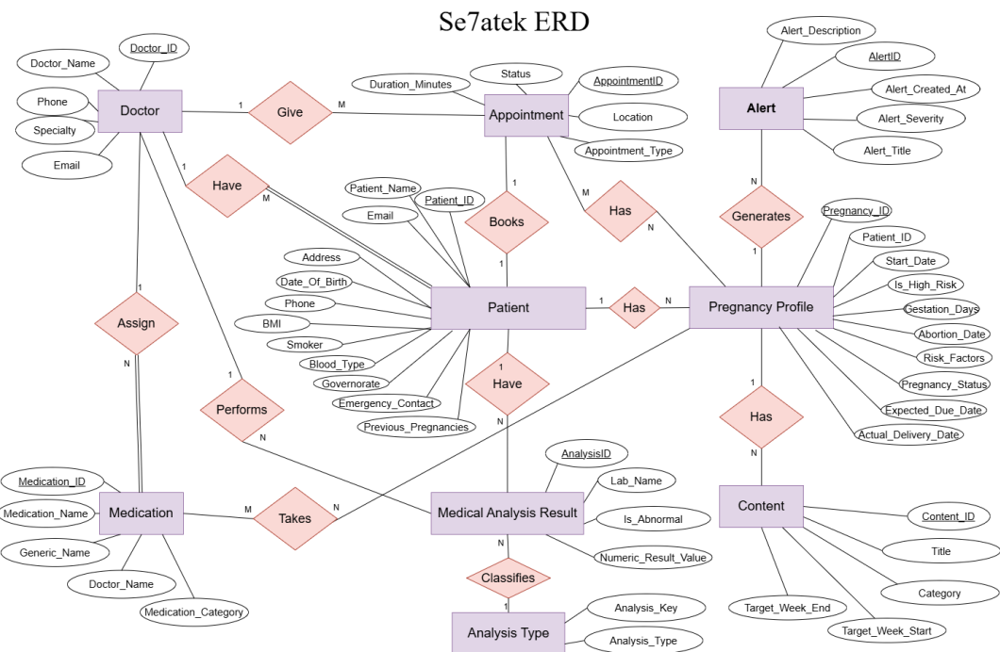

---

## Data Warehouse Schema

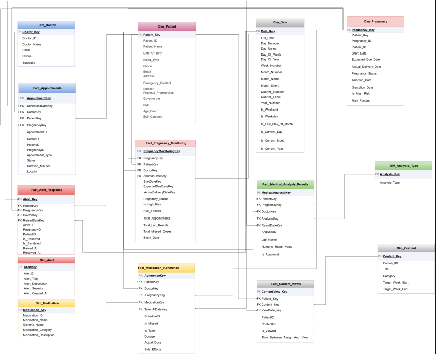

---

# 📊 Dashboards Showcase

The platform includes **20+ dashboards** across multiple domains.

---

## Executive Dashboard

Unified analytics hub.

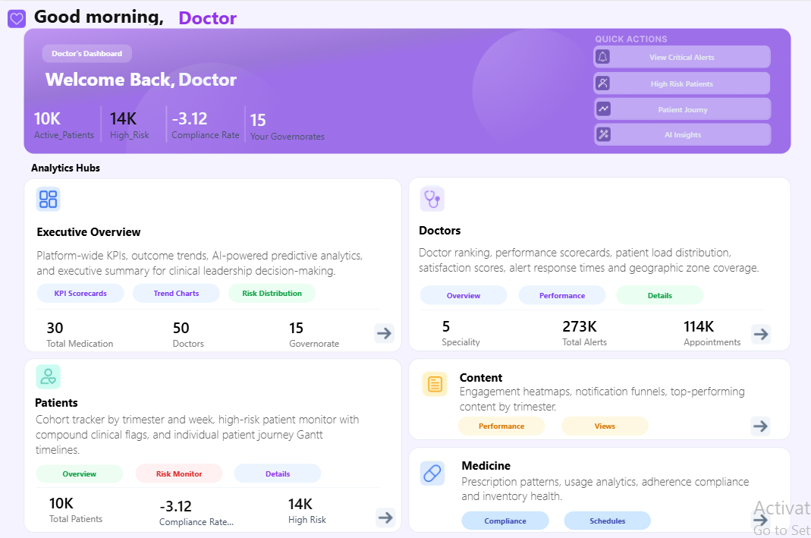

---

## Patient Journey Dashboard

Tracks:

* Demographics
* BMI
* Attendance
* High-risk patients

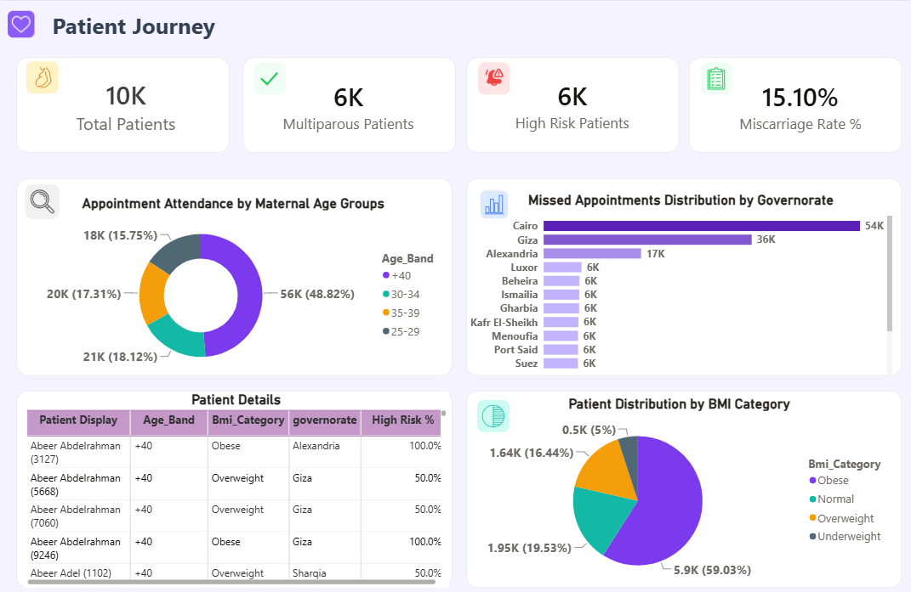

---

## Risk Monitor Dashboard

Tracks:

* Alerts
* Missed doses
* Abnormal analysis
* Risk trends

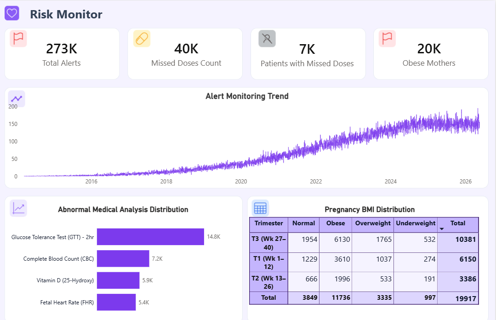

---

## Population & Risk Dashboard

Provides:

* Risk segmentation
* Population analysis
* Outcome tracking

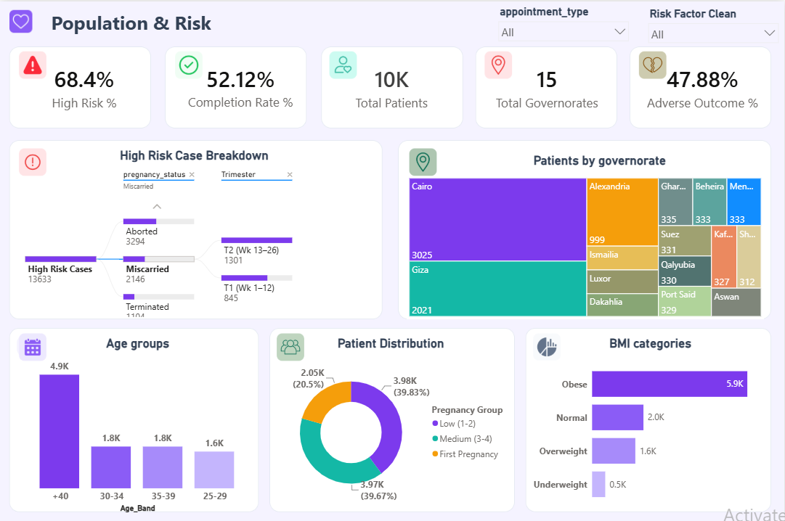

---

## Maternal Medication Analytics Dashboard

Tracks:

* Prescriptions
* Medication trends
* Adherence

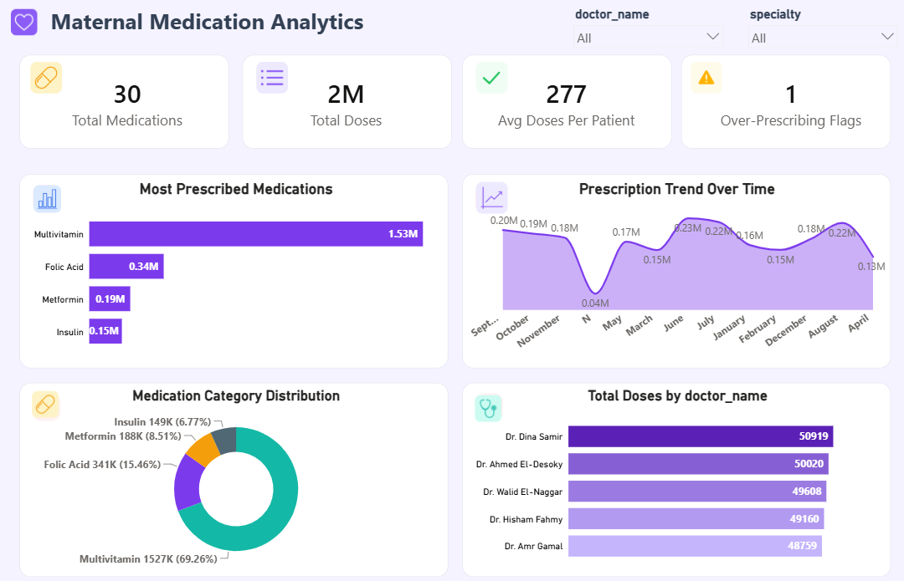

---

## Doctor Performance Dashboard

Tracks:

* Workload
* Escalation rates
* Performance metrics

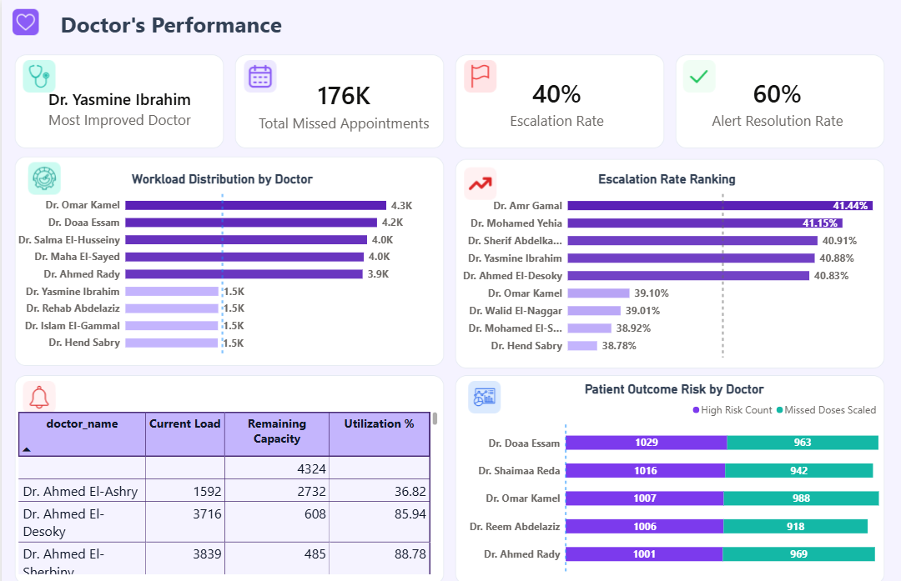

---

## Pregnancy Monitoring Dashboard

Tracks:

* Pregnancy lifecycle
* Risk progression
* Clinical risk

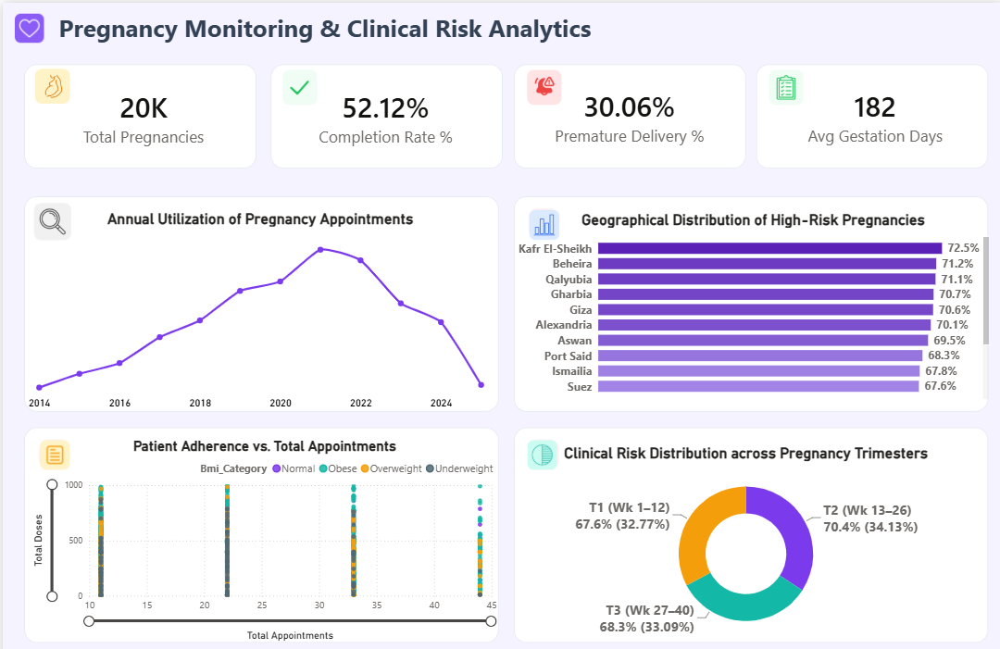

---
# 📊 Tableau Dashboards Showcase

Se7tek includes 20+ enterprise dashboards across healthcare operations.

---

# Executive Dashboard


Provides:
- Global KPIs
- Risk trends
- Operational performance
- Clinical alerts

---

# Doctor Performance Dashboard


Insights:
- Doctor workload
- Consultation time
- Patient load
- High-risk rates

---

# Pregnancy Monitoring Dashboard


Tracks:
- Active pregnancies
- Adherence rate
- Preterm risk
- Regional distribution

---

# Risk Monitoring Dashboard


Tracks:
- High-risk patients
- Medication adherence
- Missed doses
- Abnormal lab ratio

---

# Lab Analysis Dashboard


Tracks:
- Lab test trends
- Abnormal distributions
- Age & BMI analysis

---
# Patient Report

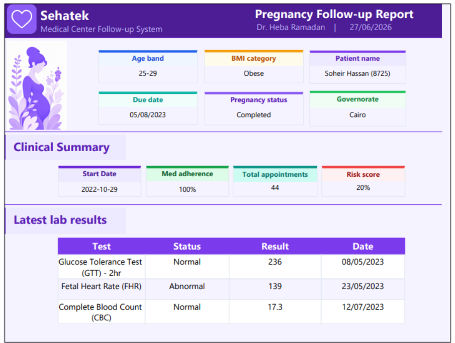

Includes:
- Clinical summary
- Risk score
- Adherence metrics
- Latest lab results

---

# Monthly Clinical Report

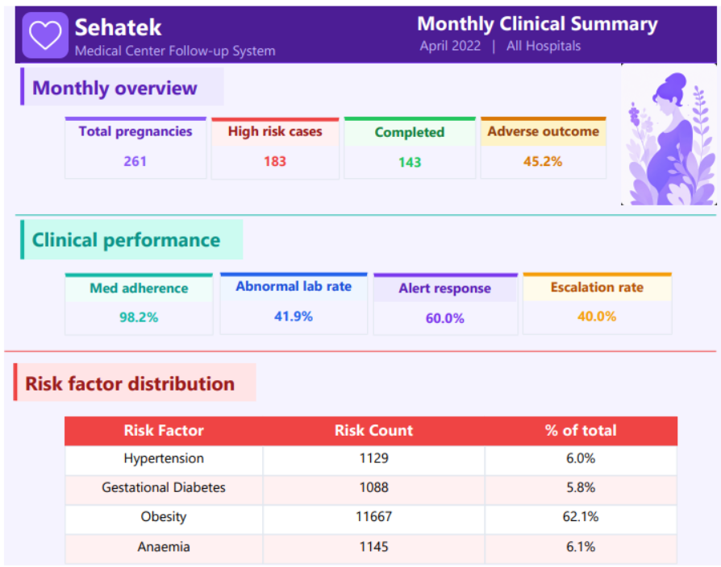

Provides:
- Pregnancy overview
- Clinical performance
- Risk factor distribution

---

# 🌐 Web Application

The web application serves as the unified analytics and AI interface.

## Main Modules

* Authentication
* Dashboard embedding
* AI assistant
* Monitoring
* Reporting

---

## User Roles

* Doctors
* Nurses
* Administrators
* Analysts

---

# 🛠️ Tech Stack

## Data Engineering

* SQL Server
* SSIS
* Azure Data Factory
* dbt
* Apache Airflow

## Data Warehouse

* SQL Server DW
* Fabric Lakehouse
* Fabric Warehouse

## BI / Analytics

* Tableau
* Power BI

## AI / ML

* RAG
* LLMs
* Embeddings
* Vector DB

## Frontend

* Web Application

---

# 📂 Repository Structure

```bash
se7tek-pregnancy-monitoring/
│
├── docs/
│   ├── assets/
│   ├── architecture/
│   ├── dashboards/
│   ├── reports/
│   ├── automation/
│   └── data-model/
│
├── on-prem/
├── cloud/
├── rag/
├── web-app/
└── README.md
```

---

# 📈 Business Impact

This platform helps healthcare organizations:

* Improve maternal care quality
* Detect risk earlier
* Improve clinical decision-making
* Increase medication adherence
* Improve patient outcomes
* Enhance operational efficiency

---

# 🔮 Future Enhancements

* Real-time streaming pipelines
* Predictive AI models
* Anomaly detection
* Personalized recommendations
* AI Copilot for clinicians

---

# 👨‍💻 Contributors

Eng.Diab Saeed
Eng.Omnia gharib
Eng.Safa Ashraf
Eng.Reem Tamer
Eng.Ahmed Hamdtuo

Built as a complete enterprise healthcare solution spanning:

* Data Engineering
* Data Warehousing
* BI Engineering
* AI Engineering
* Web Development

---

# ⭐ Support

If you found this repository useful:

* Star this repo
* Fork the project
* Contribute improvements

---

```
```
